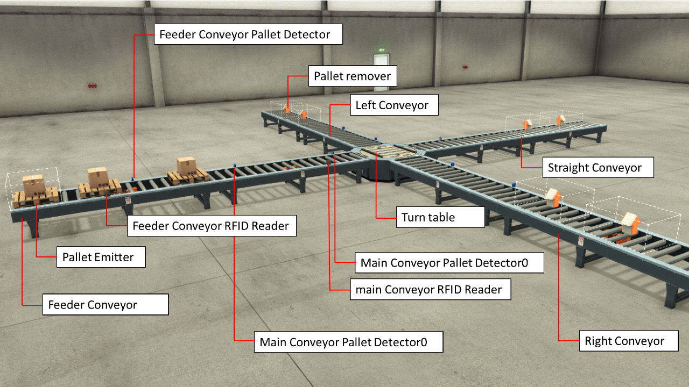

# FactoryIO RFID Based package Sorter

This project demonstrates how to control an RFID Based package Sorter Factory IO application using codesys. The factory IO application is composed of various roller conveyors on which packages are routed based on their RFID tag data value.

## Factory IO Application Description Summary


The factory line is composed of a Feeder source Conveyor, a main source conveyor, a turn table, a right destination, straight destination and left destination conveyors. The Feeder conveyors generates packages composed of a pallet and a box and passes them to the main conveyor. From main conveyor, the RFID Reader then reads the tag value of the tag attached to the box. The turn table routes the package according to the value of the tag data. 

### Mode of operation
1. First the package is emitted by the feeder conveyor. A diffuse sensor on the conveyor detects the package before it reaches the main conveyor and stops the conveyor
2. A tag data value is generated by the codesys application and written to the tag attached to the box using the RFID reader installed on this conveyor. The conveyor is restarted and the package proceeds to the main conveyor
3. A diffuse sensor on the main detects the package before it reaches the turn table and stops the conveyor. An RFID reader installed on the conveyor reads the tag data value of the RFID tag attached to the box
4. According to the tag data value, the package is then routed to the right, left or straight conveyor by the turn table

### Routing logic
The codesys application determines the conveyor on which the package will be routed to based on the RFID tag data value. 
- if the value is an odd number, then the package is routed to left conveyor 
- Else if the value is an even number but divisible by 4, then the package is routed to right conveyor 
- Else, the package is routed to the straight conveyor

## Codesys Application
The codesys application controls the conveyors, the turn table, the emitter and the two RFID readers. For this project, the codesys application is developed in Structured Text and Contionus Function Block languages and runs on a TBEN L5 PLC 11 controller.
The Codesys application reads data from the diffuse sensors on the conveyors, and the limit sensors on the turn table to perform the logic which control the whole application

## Communication between Codesys and factory IO
The codesys application readers data from instruments around the installation and sets actuators to control the whole line. This read-write process is done over Modbus TCP communication. The factory IO application hosts a Modbus server whose registers are updated with the current sensor values and new commands and data is read from by the application.
The codesys application as the Modbus TCP master reads the appropriate registers for sensor information and sets the appropriate registers for commands and data

## Usage
1. Open the Factory IO application from the Factory IO folder
2. The server address is the loopback address of the local computer. Change this is needed
3. Open the Codesys application. In the Codesys App folder, there are two applications, the ```RFID_Sorter_SP19.project``` which is developed and compatible with Codesys V3.5 SP19 and the ```RFID_Sorter_SP11.project``` which has been saved to be compatible with Codesys V3.5 SP11 or higher 
4. You can use any PLC of your choice. All you have to do is to update the Device with your PLC in Codesys

## More details
You can get an overview on how the application works by watching the Video here below
[](https://youtu.be/-BYdRWobq5A)